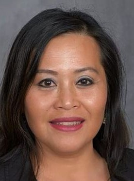
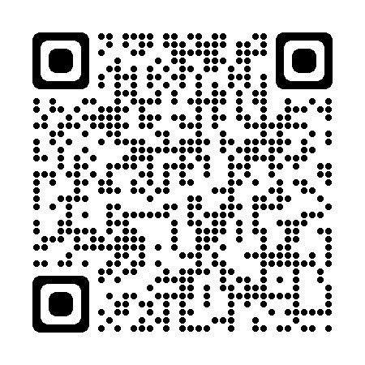

# DataSage

  

Welcome to my portfolio page! Here, you will find a collection of my projects from an AI and Machine Learning bootcamp, as well as other notable works encompassing Tableau and Resume dashboard. If you're interested in exploring my Python projects, feel free to visit my GitHub repository at [https://github.com/Vey27](https://github.com/Vey27). There, you'll find a comprehensive showcase of my coding expertise and the innovative solutions I've developed. Take a look and delve into the exciting world of data science and machine learning!

| AI & Machine Learning | Tableau | Resume |
|-----------------|------------------|---|
| [Python Projects](https://www.datascienceportfol.io/Vey) | [Tableau Dashboard](https://public.tableau.com/app/profile/vey.damneun5377) | Resume Dashboard |

# Contact Me

  
    

  

